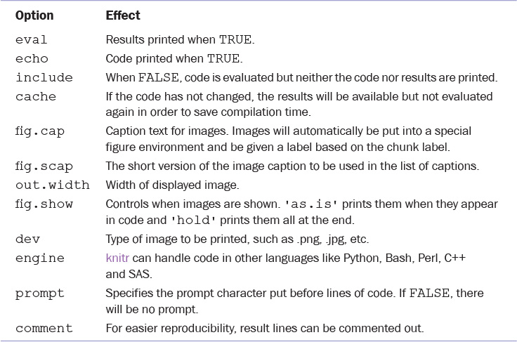

```{r setup, include=FALSE}
knitr::opts_chunk$set(echo = TRUE)
```

# R Markdown
## Intro

R Markdown has become the most popular form of creating rich documents to communicate analysis by easily combining formatted text with R code chunks and their output.  It builds on previous efforts such as sweave and knitr to weave Latex formatted text with chunks of R code, and in fact still uses knitr to compile the final document.  

Document header is a yaml header ("yet another markup language", lol), delineated by 3 dashes before and after, with various key:value pairs giving details about the document. rmarkdown package provides many output formats, including pdf_document, html_document, others. 

As seen above, we can specify sub-tags to document tags.  You do need to add at least 2 spaces for the sub-tags (tabs won't work).  The header above signifies that we want an html doc with numbered sections and a table of contents.  

This is an R Markdown document. Markdown is a simple formatting syntax for authoring HTML, PDF, and MS Word documents. For more details on using R Markdown see <http://rmarkdown.rstudio.com>.

When you click the **Knit** button a document will be generated that includes both content as well as the output of any embedded R code chunks within the document. 

## Markdown Primer

Put blank line between two blocks of text to get a line break.

This should be new line.

Get italics with single _ or * on each side of a word, two to get bold, and 3 for italics and bold.  _italics_, *italics*, **bold**, ***both***.  **works with multilpe words?**.  

Get unordered lists starting line with dash or asterisk.
- a
- b
  -  indent to nest
  - nest2
  
Ordered lists:
1. coffee
2. Tea

Latex equations.  Inline with single dollar sign: $\sqrt(\pi)$.  Or own line with 2, $$\sqrt(\pi)$$.

Links with `[Text to display](link)`.

Insert image with ``

Code with single backtick (under ~ button).


# Embedding R Code
## Code Chunks
You can embed an R code chunk like this:

```{r cars}
summary(cars)
a <- 2
print(a)
a
```

Any chunk is started with 3 backticks, then braces containing lower case "r" followed by chunk title, then any options separated by commas.  The output doc will contain blocks of input code followed by outputs at any points where the code actually produces an output. 

Note that the title of the chunk (cars) doesn't show up by default, but it is used for processing purposes.  We also can't use same label twice.  

We can also add various options within the curly braces for each chunk.  E.g. we can set `eval=FALSE` to not display/evaluate output, or we can set `echo=FALSE` to not display/echo the code.

```{r cars2, eval=FALSE}
summary(cars)
```

Here are some other options, which is Table 27.2 in R for Everyone book:



## Including Plots

You can also embed plots, for example:

```{r pressure, echo=FALSE}
plot(pressure)
```

Note that the `echo = FALSE` parameter was added to the code chunk to prevent printing of the R code that generated the plot.


# HMTL Widgets

R has many packages to facilitate building wide array of useful interactive html graphics without needing to know javascript.  These interactive graphics can be integrated into the HTML output, or can also be displayed as static images in pdf outputs.  

The main package is `htmlwidgets`, and has many sub packages such as `DT` for displaying tabular data, `leaflet` for rich maps, `d3heatmap`, and others.

These packages are particularly useful for generating interactive shiny apps.  Lets dig in.

## datatables

We can create nice static displays of data from tables using kable from knitr package.  The display is cleaner than we would get if we just output the df itself.

```{r kable}
knitr::kable(head(iris), caption='Tabular data printed using kable.')
head(iris)
```

We can also use the `DT` package, an `htmlwidgets`-based package, to generate interactive displays of tabular data.

```{r DT}
#install.packages('DT')
library(DT)
data(diamonds, package='ggplot2')
#DT package load the datatable function
datatable(head(diamonds, 100))
```

The **DT** package has many options, extensions, and plugins.  One tricky aspect is that some options can be specified directly as an argument within `datatable()`, and some need to be part of a list of arguments fed into the `options` argument of `datatable()`.  May have to consult datatable documentation to see what goes where.  

```{r DT2}
datatable(head(diamonds, 100),
          rownames=FALSE, 
          extensions='Scroller', filter='top',
          options = list(dom = "tiS", scrollX=TRUE,
                         scrollY = 400,
                         scrollCollapse = TRUE))
```

We can further customize output by passing `datatables` object, via pipe, to formatting functions.  

```{r DT3}
datatable(head(diamonds, 100),
          rownames=FALSE,
          extensions='Scroller', filter='top',
          options = list(dom = "tiS", scrollX=TRUE,
                         scrollY = 400,
                         scrollCollapse = TRUE)) %>%
  formatCurrency('price', digits=0) %>%
  formatStyle(columns='cut', valueColumns='cut',
              target='row',
              backgroundColor=styleEqual(levels=c('Good','Ideal'),
                                         values=c('red', 'green')))
```


## dygraphs
Plot time series. 

Use WDI package to access data through World Bank's API.

```{r WDI_data}
#install.packages('WDI')
library(WDI)
gdp <- WDI(country=c("US", "CA", "SG", "IL"),
           indicator=c("NY.GDP.PCAP.CD"),
           start=1970, end=2011)
# give it good names
names(gdp) <- c("iso2c", "Country", "PerCapGDP","Year")
head(gdp)
```

Convert data to wide format.
```{r WDI_data2}
gdpWide <- gdp %>%
  dplyr::select(Country, Year, PerCapGDP) %>%
  tidyr::spread(key=Country, value=PerCapGDP)
head(gdpWide)
```

Now we can create interactive graphic with `dygraphs`.
```{r dygraphs}
library(dygraphs)
dygraph(gdpWide, main='Yearly Per Capita GDP',
        xlab='Year', ylab='Per Capita GDP') %>%
  dyOptions(drawPoints = TRUE, pointSize = 1) %>%
  dyLegend(width=400)
```

## d3heatmap
```{r d3heatmap}
#Seems to be a problem installing d3heatmap
#install.packages('d3heatmap')
# library(d3heatmap)
# data(economics, package='ggplot2')
# econCor <- economics %>% select_if(is.numeric) %>% cor
# d3heatmap(econCor, xaxis_font_size='12pt',
#           yaxis_font_size='12pt',width=600, height=600)
```

## Other htmlwidgets packages
Some other useful ones are leaflet (interactive maps), threejs (3D scatterplots and globes that can be spun around)

# RMarkdwn Slideshows

We can also use RMarkdown to create HTML slideshows.